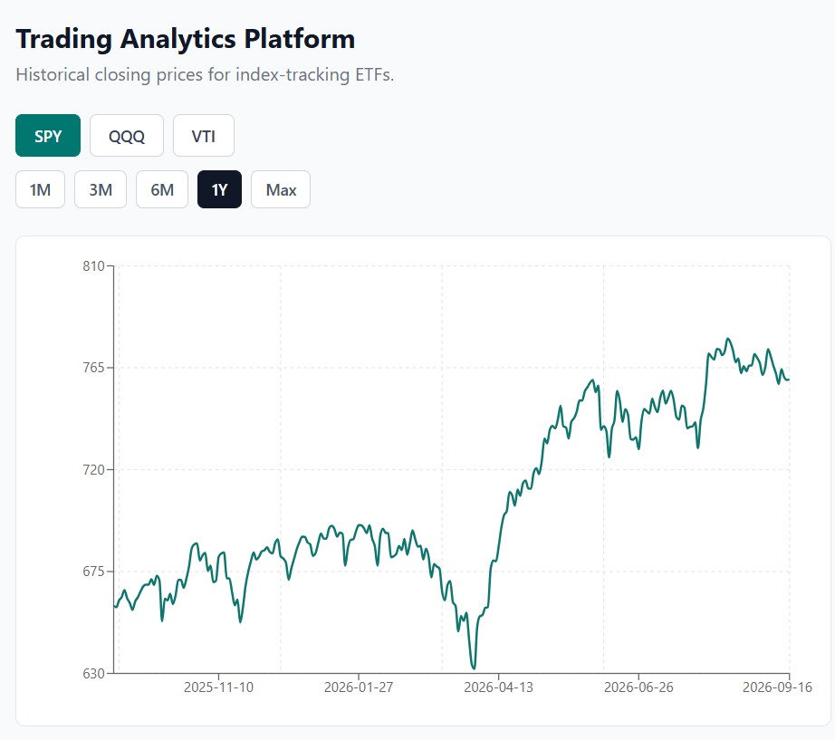
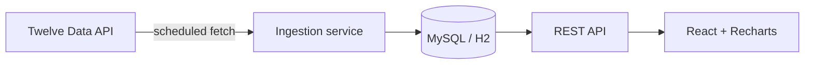

# Trading Analytics Platform

A full-stack platform for viewing and analysing the historical performance of index-tracking ETFs (SPY, QQQ, VTI). It fetches daily market data on a schedule into its own database and serves it through a REST API to a React frontend. It is an analytics and education tool, deliberately not a trading or advice tool.

**Live demo:**  https://trading-analytics-platform-ten.vercel.app 




## What it does

- View a fund's full price history as an interactive line chart
- Switch between funds (SPY, QQQ, VTI)
- Filter the chart by time window (1M / 3M / 6M / 1Y / Max)
- All data is served from the application's own database, not fetched live per request

## Architecture

The core design goal was to work around a rate-limited market-data API. Rather than call the external API on every user request, a scheduled job pulls data into the application's own database, and every user request is served from there. The external API is only ever touched by the background job, so a user request never depends on the external API being available or within its rate limit.



Writes (ingestion) and reads (serving) are separated by the database. Because the app serves from its own store, it also degrades gracefully: if the external API were ever unavailable, the app keeps working with the data it already holds.

## Tech stack

| Layer | Technology |
| --- | --- |
| Backend | Spring Boot 4.1, Java 17, Maven |
| Persistence | Spring Data JPA / Hibernate, H2 (dev), MySQL (prod) |
| API style | REST |
| Market data | Twelve Data API |
| Frontend | React, Vite, Tailwind CSS, Recharts |
| Deployment | Railway (backend + MySQL), Vercel (frontend) |

## Design highlights

- **Scheduled, idempotent ingestion.** A scheduled job ingests daily bars into the database. A composite unique constraint on `(fund, date)` plus an existence check means the job is safe to run repeatedly and never creates duplicate data.
- **Environment-specific configuration with Spring profiles.** The same codebase runs on an in-memory / file-based H2 database locally and MySQL in production, switched by a Spring profile, with no application code changes.
- **Secrets kept out of the repo.** The API key and database credentials live only in a git-ignored local file in development and are injected as environment variables in production. No secrets are committed or exposed to the frontend.
- **DTOs at the API boundary.** Endpoints return response DTOs rather than JPA entities, so the internal data model and its relationships are never exposed in the API.
- **Centralised error handling.** A global exception handler returns a consistent JSON error shape and correct HTTP status codes across every endpoint.
- **Memory-aware production ingestion.** The scheduled refresh fetches only recent bars rather than full history, keeping the running container's memory footprint small.

## Running locally

You will need Java 17, Maven, Node.js, and a free [Twelve Data](https://twelvedata.com) API key.

### Backend

1. In `src/main/resources`, create `application-local.properties` (git-ignored) with your key:
   ```properties
   twelvedata.api-key=YOUR_KEY_HERE
   ```
2. Run the application (`./mvnw spring-boot:run`, or run it from your IDE). It starts on `http://localhost:8080` using a local H2 database.
3. Load some data by triggering an ingest (dev only):
   ```
   POST http://localhost:8080/admin/ingest/SPY
   ```

### Frontend

1. In the `frontend` folder, create a `.env` file:
   ```
   VITE_API_BASE_URL=http://localhost:8080
   ```
2. Install and run:
   ```
   cd frontend
   npm install
   npm run dev
   ```
3. Open `http://localhost:5173`.

## Roadmap

- **v1 — Historical price charts (complete, deployed).**
- v2 — Compare multiple funds side by side, normalised to percentage change.
- v3 — Key metrics per fund (returns, volatility, high/low, moving averages).
- v4 — Plain-English explanations of the data, grounded in the app's own computed metrics.
- v5 — Accounts and saved fund watchlists (Spring Security + JWT), with the core charts staying public.

## Note

This project is for analysis and education only. It does not provide financial or investment advice.